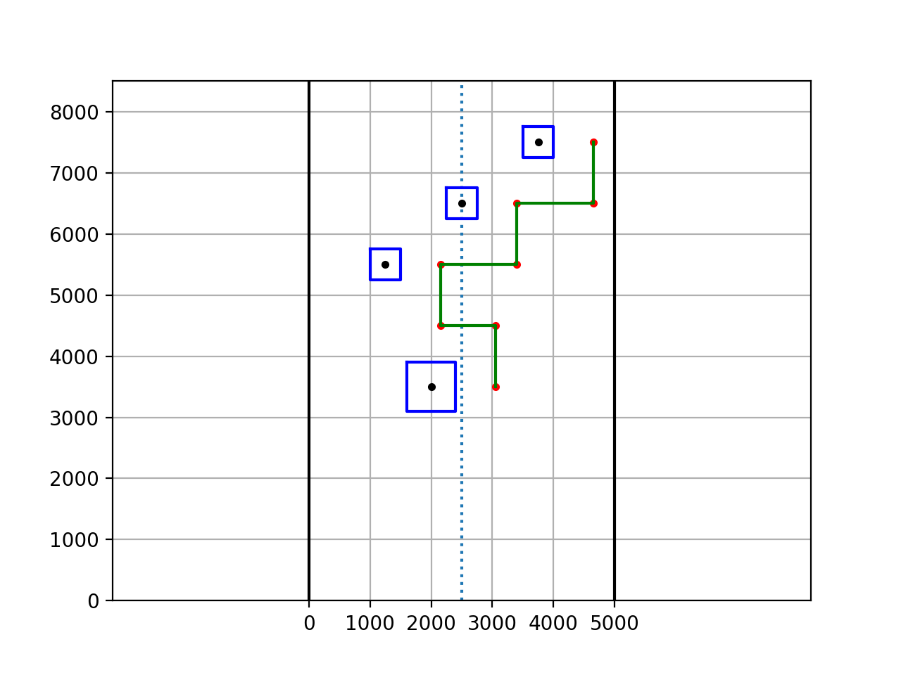

PathPlanning for Kosen-Robocon 2018
====

## Overview
This is the program of the control station(CS) used in Kosen-Robocon 2018-Bottle-Flip Cafe-.

## Description
Detects the location of the table with image recognition and creates a route for the automatic robot.When automatic robot has set up all plastic bottles, this detect whether they are standing by using the learning model created by tensorflow.

## Requirement
- Python 3.6.2 :: Anaconda custom (64-bit)
- Intel RealSense Depth Camera D435
- pyrealsense2(you need to build sdk by yourself [github](https://github.com/IntelRealSense/librealsense/tree/master/wrappers/python))

## How to use
After install all requirments, run the following in shell:
```
python detection.py
```
Then start detection.  
If detection is succeeded, do path planning and send path to automatic robot automatically.
  
If you want to try only path_planning, run the following in the shell:
```
python path_planning.py [under table x] [middle table x] [up table x] [zone]
```
zone = 1: red zone  
zone = 0: blue zone

example:
```
python path_planning.py 1250 2500 3750 0
```



